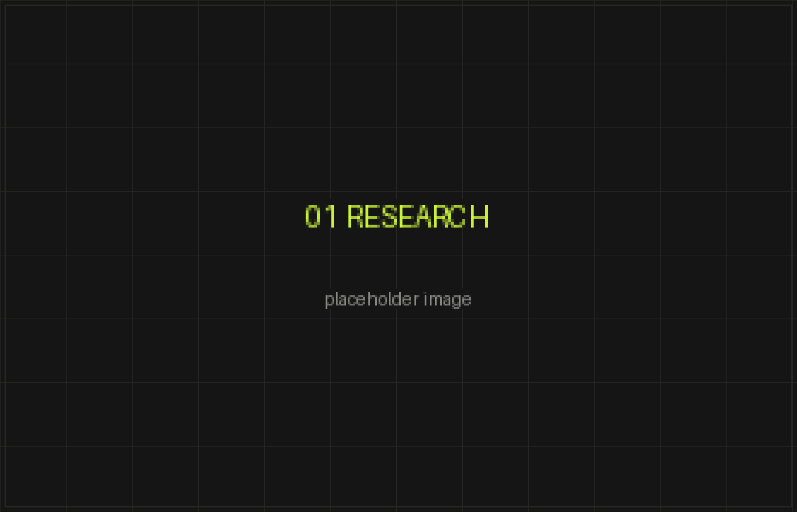
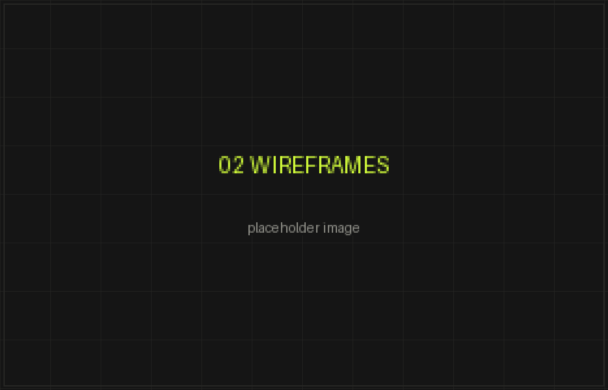
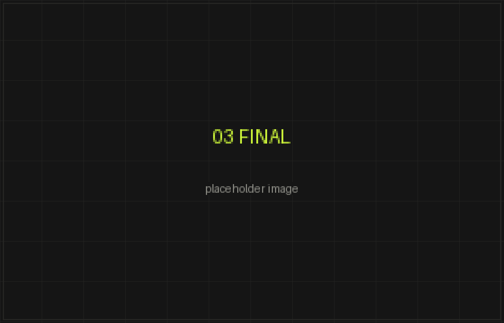

## Problem

A scheduling tool for clinics asked every new account for eleven pieces of
information before it would let anyone in. Of the people who opened the signup
form, a third finished it. Sales had a full pipeline and the product was quiet.

Nobody on the team thought the form was the problem. Everyone had an answer they
needed from it, and each answer was reasonable on its own.

## Constraints

Six weeks. Every field had somebody's name on it: sales needed company size,
finance needed country, marketing needed the attribution question. A pricing
change was a week out, so nothing could touch billing. And I couldn't delete
anyone's field — only argue for it.

## What I did

I found out what each field was actually used for, which meant asking the person
who wanted it and then checking the data behind their answer.

Two of the eleven were never read by anyone. One was 61% blank. Then I watched
eight people sign up on their own laptops, thinking aloud. Two stopped at the
phone number. One typed a fake one and said, without being asked, "they're going
to call me."

## Decisions and why

**Three fields at the door.** Work email, password, company. Everything the
product genuinely needs to make an account.

**The rest moved inside the trial**, where the same questions stop being a toll
and start being setup. "Company size" became "how many clinics are you
scheduling for?" — the same data, phrased as something that configures the
product. Answer rate on it went *up*.

**Phone and attribution went entirely.** I brought the sales team the number of
calls they'd made to pre-conversion trials in six months. It was eleven. They
agreed to drop it.

## Outcome

Form completion went from 34% to 71%. Completed trials rose a third month over
month against a flat top of funnel. Trial-to-paid didn't move — same quality of
lead, just more of them.

The number I didn't expect: support tickets about the wrong workspace name fell
to almost nothing, because people now name their workspace while looking at it
instead of during a signup form.

## What I'd change

I ran this as an argument about fields when it was really an argument about
where a question belongs. The framing I landed on late — *this is a toll at
signup and setup inside the product* — would have won every one of those
conversations in a quarter of the time.
